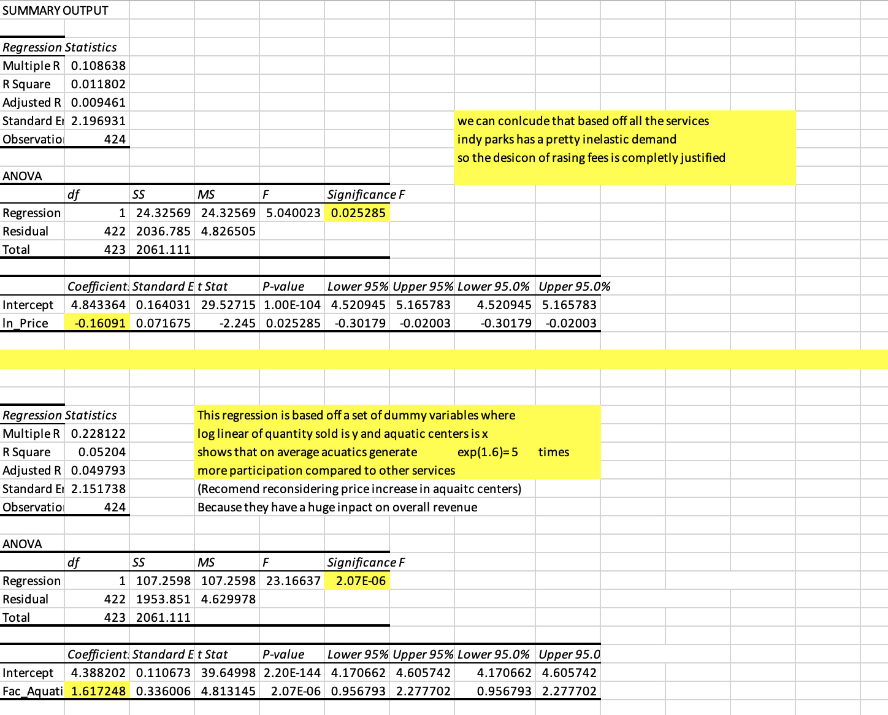
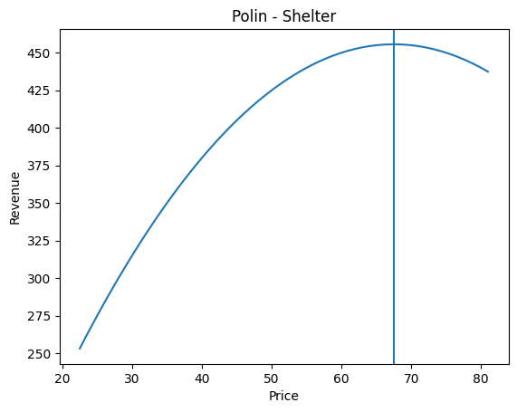
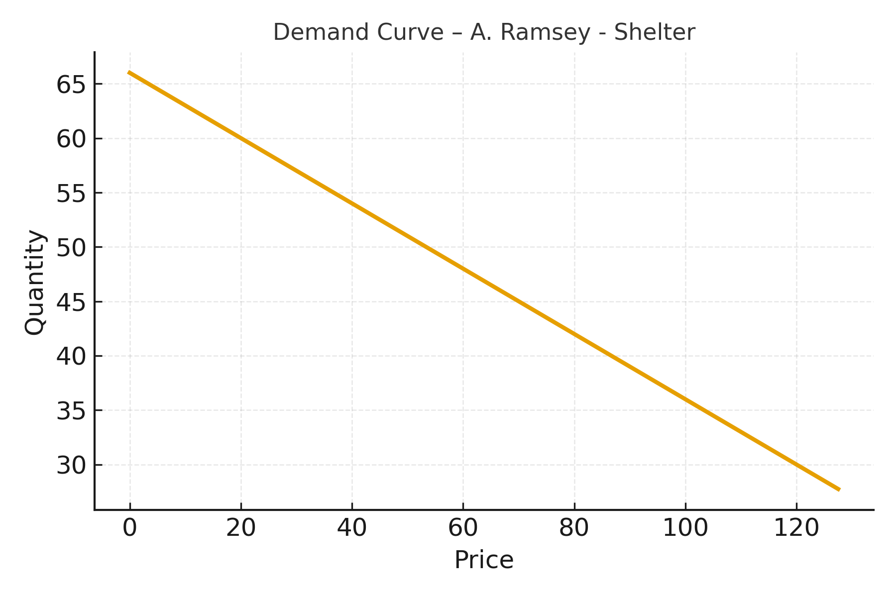
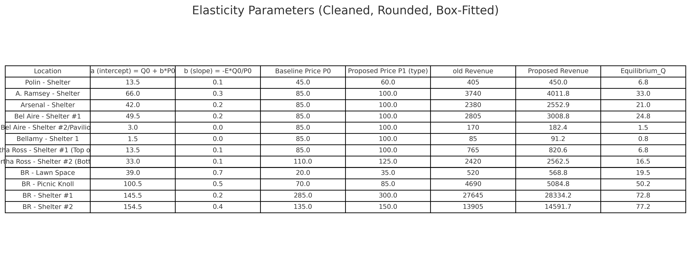
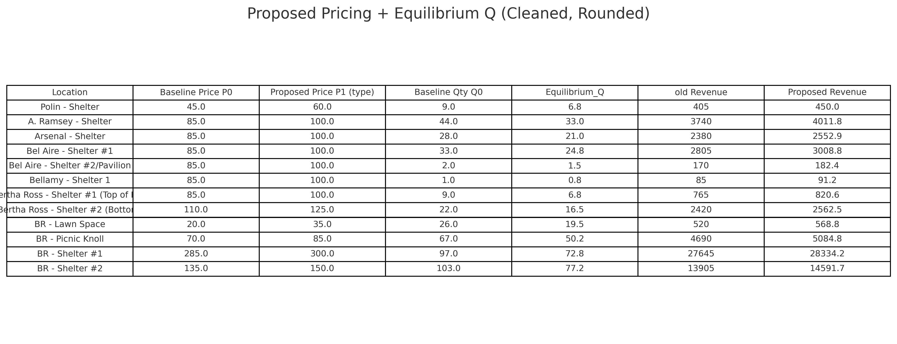
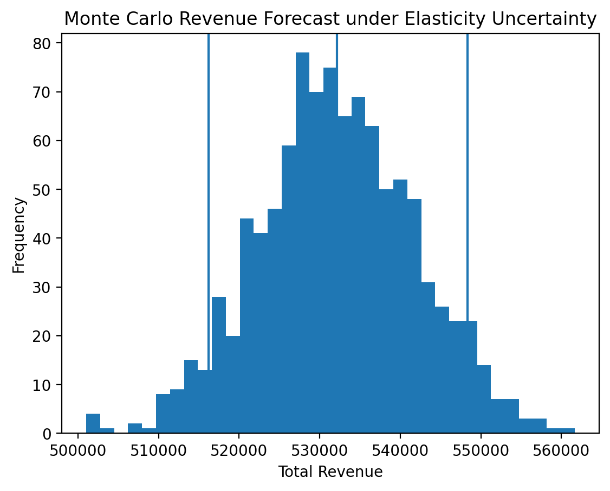
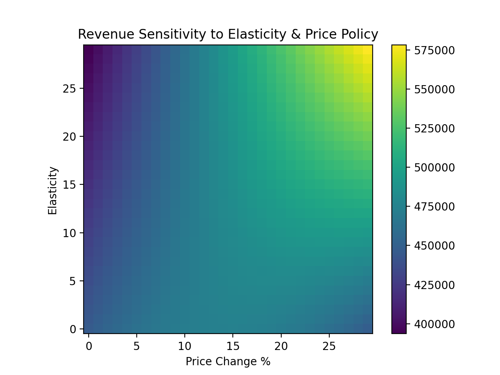

# Indianapolis Mayor’s Office – Parks & Recreation Revenue Optimization Model

**Data Analyst Intern Project — Indianapolis Mayor’s Office, Office of Parks & Recreation**

---

## Business Problem

The **Indianapolis Mayor’s Office – Office of Parks & Recreation** required a data-driven approach to evaluate 2026 park service pricing while balancing:

- Revenue growth  
- Cost-recovery targets  
- Public demand sensitivity  
- Uncertainty in elasticity estimates  

---

## Project Objective

Develop an end-to-end analytics system to:

- Estimate **price elasticities** using regression  
- Construct **demand curves** for park services  
- Simulate **pricing scenarios** in Excel  
- Forecast revenue under uncertainty using **Python**  
- Quantify financial risk with **Monte-Carlo simulation**  
- Identify revenue-maximizing price points  

---

## Tools Used

- **Excel** – elasticity estimation, scenario modeling, dashboards  
- **Python (pandas, NumPy, matplotlib)** – demand forecasting, revenue optimization, Monte-Carlo simulation  
- **GitHub** – documentation & version control  

---

## Project Structure

```
data/        Pricing datasets & elasticity models  
model/       Excel elasticity & scenario simulation workbook  
regression/  Elasticity regression outputs  
visuals/     Original demand curves & revenue scenario charts  
python/      Forecasting & optimization notebook  
images/      Monte-Carlo & policy sensitivity outputs  
```

---

## Methodology

### 1. Elasticity Estimation (Regression)

ln(Qₜ) = α + β · ln(Pₜ) + εₜ



---

### 2. Demand Curve Modeling (Excel)

b = -E · (Q0 / P0)
a = Q0 + b · P0
Q(P) = a - bP


  


---

### 3. Revenue Scenario Simulation (Excel)

  


---

### 4. Python Revenue Optimization Engine

```python
def revenue(a,b,p):
    return p * max(a - b*p, 0)
```

---

### 5. Monte-Carlo Revenue Risk Simulation

| Metric | Total Revenue |
|------|------|
| Expected Revenue | $532,113 |
| Worst Case (5%) | $516,235 |
| Best Case (95%) | $548,311 |

Monetary risk range: **$32,076**



---

### 6. Policy Sensitivity Analysis



---

## Business Impact

- Identified underpriced services  
- Quantified revenue impact before fee changes  
- Strengthened cost-recovery strategies  
- Communicated fiscal risk using probabilistic forecasting  
- Delivered defensible pricing recommendations  
