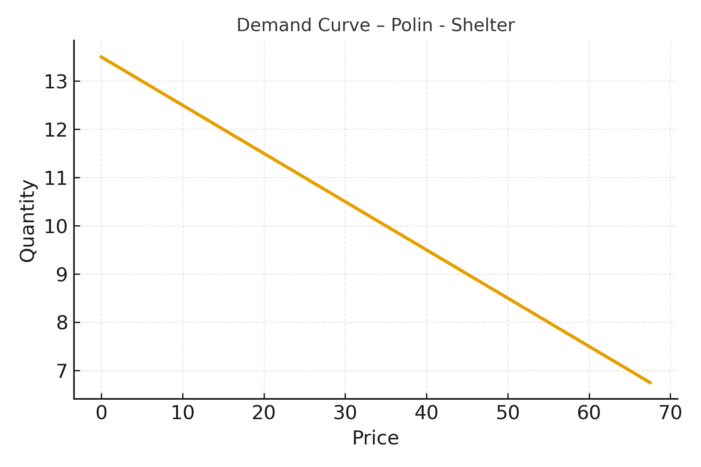

# Indianapolis Mayor’s Office – Parks & Recreation Revenue Optimization Model

**Data Analyst Intern Project — Indianapolis Mayor’s Office, Office of Parks & Recreation**

---

## Business Problem

The **Indianapolis Mayor’s Office – Office of Parks & Recreation** required a data-driven approach to evaluate 2026 park service pricing while balancing:

- Revenue growth  
- Cost‑recovery targets  
- Public demand sensitivity  

---

## Project Objective

Develop an Excel-based analytics system that could:

- Estimate **price elasticities**
- Simulate multiple **pricing scenarios**
- Forecast revenue under demand response
- Provide defensible analysis for **Mayor’s Office budget discussions**

---

## Tools Used

- **Excel** – elasticity estimation, revenue simulation, dashboards  
- **Power BI** – planned interactive dashboard layer  
- **GitHub** – documentation and version control  

---

## Project Structure

```
data/        Cleaned pricing datasets  
model/       Elasticity & scenario simulation workbook  
regression/  Elasticity regression outputs  
visuals/     Demand curves & scenario charts  
```

---

## Methodology

### 1. Elasticity Estimation
Linear regression models were used to estimate price elasticity across park service categories.


### 2. Demand Curve Modeling
Estimated elasticities were applied to construct demand curves and model usage response.

  


### 3. Revenue Scenario Simulation
Pricing scenarios were evaluated to identify revenue‑neutral and revenue‑maximizing strategies.

  


---

## Business Impact

This model supported the **Indianapolis Mayor’s Office – Parks & Recreation** in:

- Identifying underpriced services  
- Quantifying revenue impact prior to fee adjustments  
- Strengthening cost‑recovery strategy  
- Presenting data‑backed recommendations to finance leadership  

---

## Contact

**Jordan Small**  
📧 jordsmal@iu.edu  
🔗 https://linkedin.com/in/jordan-small-6b142425a
